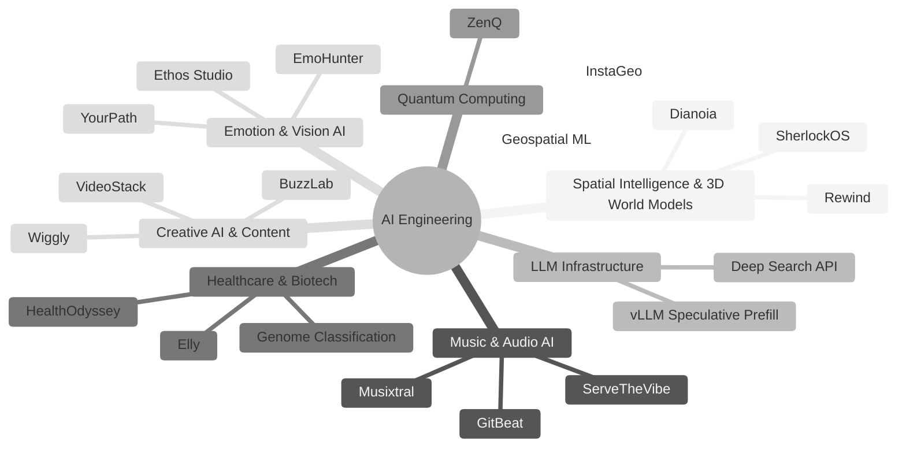
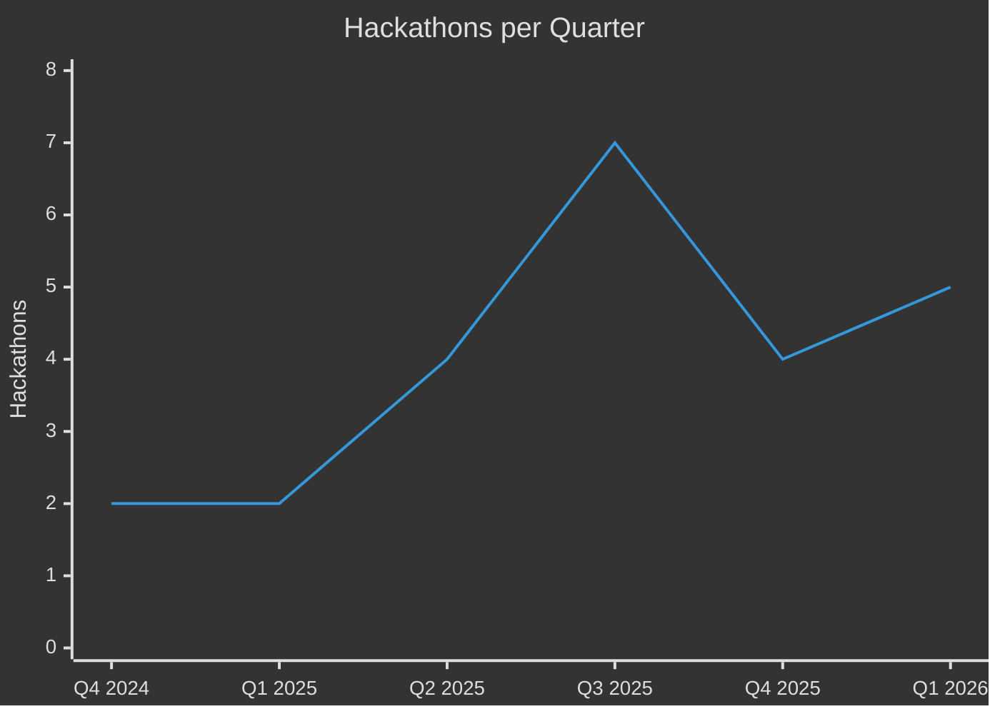

## About Me

```yaml
name: Yongkang ZOU
location: Paris, France
role: AI Engineer
focus: AI Agents, LLMs, Multimodal AI, MCP Servers
hackathons_won: 9
superpower: Going from 0 → demo in under 20 hours
```

[](https://yongkang-zou-portfolio.vercel.app)
[](https://linkedin.com/in/yongkang-zou)
[](https://github.com/inin-zou)

---


## Tech Stack

**Languages**<br/>


**AI / ML**<br/>


**Frameworks & Tools**<br/>


---

## Domains I Explore



---

## Hackathons

> *24 hackathons. 9 wins. Always shipping.*



| Date | Hackathon | Project | Result |
|------|-----------|---------|--------|
| 2026.03 | TechEurope Stockholm | [Dianoia](https://github.com/inin-zou/Dianoia) — AI crime scene investigation | 3rd place (solo) |
| 2026.03 | Mistral Online | [Ethos Studio](https://github.com/aytoast/ser) — Emotional speech recognition | |
| 2026.02 | HackEurope | [YourPath](https://github.com/CodyAdam/your-path) — AI interactive video game | |
| 2026.02 | Gemini Hackathon | [SherlockOS](https://github.com/inin-zou/SherlockOS) — Spatio-temporal deduction engine | |
| 2026.02 | TechEurope Paris | [Rewind](https://github.com/inin-zou/Rewind) — Memory revisiting in 3D | |
| 2025.12 | Project ElevenLabs | [VideoStack](https://github.com/VideoStack-PE/videostack-elevenlabs) — AI-powered video creation platform | 87K EUR early interest funding |
| 2025.11 | Junction | [Lumina](https://github.com/cesp99/lumina-frontend) — CISO-ready vulnerability intelligence system | |
| 2025.10 | Entrepreneurs First | [Deep Search API](https://github.com/Rodrigotari1/deep_research_ef) — AI deep research | 1st place |
| 2025.10 | Big Berlin | [Wiggly](https://github.com/Konsequanzheng/wiggle) — AI 3D T-shirt design | |
| 2025.09 | Datacraft | [Le Scribe Royal](https://github.com/dorianlagadec/hackathoh-versailles) — AI assistant for Versailles | 3rd place |
| 2025.09 | Tech Europe Paris | [GitBeat](https://github.com/imbjdd/gitbeat) — Turn GitHub repos into music | Community Win |
| 2025.09 | Mistral AI MCP | [Musixtral](https://github.com/inin-zou/Musixtral) — AI music production via MCP | |
| 2025.09 | ShipItSunday | [I Swear](https://github.com/inin-zou/damn-it) — Anti-procrastination betting | |
| 2025.08 | Hack Nation MIT | [BuzzLab](https://github.com/inin-zou/BuzzLab) — AI video creation platform | Finalist (VC phase) |
| 2025.08 | Pond Speedrun | [EmoHunter](https://github.com/inin-zou/EmoHunter-Pond_Hackathon) — Emotion detection + Apple Watch | 1st place ($50K funding) |
| 2025.07 | AMD Hackathon | vLLM speculative prefill on AMD GPUs | |
| 2025.06 | RAISE Summit | [ServeTheVibe](https://github.com/inin-zou/ServeTheVibe) — Humming to music | 3rd place (solo) |
| 2025.06 | Dify Paris | Dify AI Agent — Agentic workflow automation | 1st place (solo) |
| 2025.05 | Phagos | [Genome Classification](https://github.com/inin-zou/Genome-Embedding-Classification) — Phage AI pipeline | |
| 2025.04 | From RAG to Agentic AI | [OnTrack](https://github.com/briacSck/ON-TRACKS-AI-Agents-Hackathon-) — Agentic AI task tracker | 2nd place |
| 2025.02 | GeoAI Hack | [InstaGeo](https://github.com/inin-zou/InstaGeo-E2E-Geospatial-ML) — Geospatial ML | |
| 2025.02 | Doctolib | [HealthOdyssey](https://github.com/inin-zou/HealthOdyssey) — OneHealth early warning dashboard for food safety & public health | |
| 2024.11 | Quantum Challenge | [ZenQ](https://github.com/inin-zou/ZenQuantum) — Quantum CNN for Perceval | Finalist (2nd phase) |
| 2024.11 | SpotOn: Edge Device Hackathon | [Recipe Recommendation](https://github.com/Lucine1998/Recipe-Recommandation) — ML-powered recipe suggestions on edge device | |

---

<div align="center">


<br/>


<br/>


<br/>


<br/>


</div>

---

<div align="center">

### Let's build something together

[](mailto:yongkang.zou1999@gmail.com)
[](https://linkedin.com/in/yongkang-zou)
[](https://yongkang-zou-portfolio.vercel.app)

</div>
